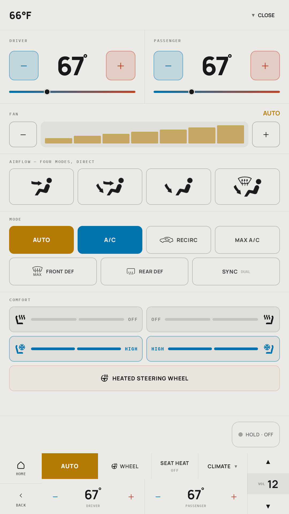
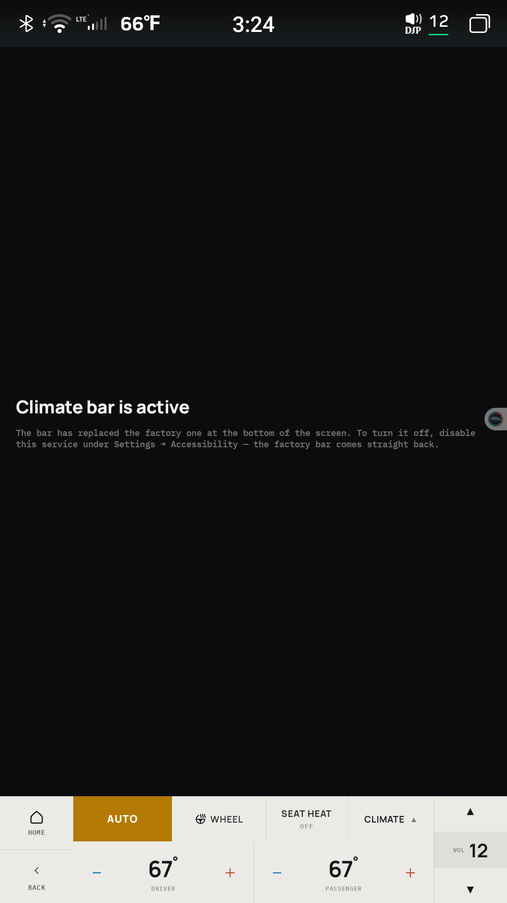

# wk2-climate

A replacement climate and navigation UI for the OEM `com.syu.air` bottom bar on
FYT/SYU **UIS7870** head units, built for a **Jeep Grand Cherokee WK2**.

The OEM bar packs roughly 24 same-weight targets into three rows, none taller
than ~70px, and none of it is adjustable. This replaces the resting bar with six
functions at a 96dp minimum target and moves everything else one tap away onto a
full-page climate view.

**Status: built and running in the vehicle.** Both screens are implemented,
reviewed and verified on hardware. 129 tests.

---

## In the vehicle

The bar, replacing the factory one in place at `[0,1693][1080,1920]`:

The panel, opened by `CLIMATE` — note the bar is still visible along the bottom,
and its caret has flipped to point down, because the same control dismisses it:

And the one screen that is a normal activity, reached from the launcher icon. It
exists only to report whether the service is enabled and to deep-link to the
toggle, because an app cannot grant itself accessibility:

All three are captured off a running vehicle, not a mockup or an emulator. Every
value shown is what the car reported: 66&#176;F outside with both zones at 67,
`SYNC` **un**lit because unlit means synced on this vehicle (the signal is
`DUAL`, so its polarity is inverted), `AUTO` owning the fan, and seat cooling on
`HIGH` both sides.

---

## What is built

| | |
|---|---|
| **Screen 2a — the bar** | Replaces the factory bar in place at `[0,1693][1080,1920]`. Nav, volume, AUTO, a pair of adaptive cells that follow outside temperature, both setpoints, and CLIMATE. |
| **Screen 1d — the panel** | Opens over app content at `[0,0][1080,1693]`, so the bar stays visible beneath it. Zones, fan, four airflow modes, seven mode tiles, comfort grid, hold-to-confirm power-off. |
| **`:bus`** | The vendor protocol behind a testable seam, with an adversarial fake that reproduces measured vehicle quirks. |

### Things the vehicle taught us that no document did

- **Registration notifies on *change*** and replays the vendor's cache;
  `IRemoteModule.get` is answered but always empty. So registration is the only
  read path, and signals the vendor has not learned yet arrive late — a bounded
  re-registration retry closes that gap.
- **`AUTO` toggles**, it does not merely set. The command table's `"AUTO on"`
  label described one observer's experiment, not the semantics.
- **`SYNC`'s signal is the vendor's `DUAL` flag**, so it is inverted: `1` means
  the zones are *independent*. Dual zone means two zones.
- **`MAX A/C`** drives the fan to 7, clears AUTO and forces recirculation.
- **The seat cycle is `0 -> 3 -> 1 -> 0`** — high before low, and state 2 is
  never visited.
- **There is no cabin-temperature signal at all**, confirmed by decompiling the
  vendor CANBUS app.

Full write-ups, including the failed hypotheses, are in
[`docs/captures/`](docs/captures/).

### The one thing that needs a workaround

The vendor MCU service (`com.syu.ms`) force-stops **27 packages** on sleep
through a hidden `ActivityManager` API, skipping only names that match a regex
compiled from an asset inside its own APK — and `com.syu.air` is on that list,
which is why the factory bar survives. Being force-stopped also prunes an
accessibility entry at the framework level, and a stopped package has no process
left to re-add it.

So the `applicationId` is **`com.android.wk2climate`**, chosen to land inside
that regex. It is namespace squatting, deliberately, and
[the write-up](docs/captures/2026-09-09-syu-ms-force-stop.md) explains exactly
why nothing else works — a foreground service and a `deviceidle` exemption both
fail, because `forceStopPackage` ignores process importance entirely.

---

## Relationship to 7870-Projects

The reverse-engineering that makes this possible lives in
**[chrisuthe/7870-Projects](https://github.com/chrisuthe/7870-Projects)** and its
[wiki](https://github.com/chrisuthe/7870-Projects/wiki) — the SYU IPC framework,
the 87 `U_AIR_*` read codes, the WK2 command index table, and the screen-space
constraints. That repo is the protocol reference; this one is the app.

Nothing here needs root.

## How it works, in one paragraph

The vendor ships a three-interface AIDL framework (`com.syu.ipc`) that is **not
permission-gated** — an ordinary third-party app can bind it and both read and
write the vehicle bus. This app binds three modules (0 MAIN, 4 SOUND, 7 CANBUS),
subscribes to the climate state, and renders entirely from what the vehicle
reports. A tap dispatches a command and mutates nothing locally; the UI updates
when the vehicle reports the new value.

`com.syu.air` **keeps running underneath**. This is an alternative front end, not
a replacement service — a crash here must never leave a vehicle with no physical
HVAC controls unable to change its climate.

## Design

| Path | |
|---|---|
| [`docs/superpowers/specs/`](docs/superpowers/specs/) | The design spec — architecture, bus layer, reconciliation against the verified protocol, testing strategy, car-session checklist |
| [`design_handoff_system_navigation/`](design_handoff_system_navigation/) | The approved visual design. Authority on geometry, colour, type and spacing |

The design file (`System Navigation.dc.html`) renders in a browser — open it and
use the `2a` and `1d` badges to find the two approved screens. Earlier
explorations (`1a`, `1b`, `1c`, `1e`) are kept for context and are **not** built.

The panel is 1080x1920 at 160dpi, so **1px = 1dp** and every measurement in the
design is used directly as a dp value.

## Portability

Read codes (`U_AIR_*`) are universal across FYT UIS7870 units. **Command indices
are per-vehicle** and the ones here match `Car_0374_PA_Jeep_Wrangler`. On another
vehicle they must be swept and rebuilt — see
[wiki: Sending Commands](https://github.com/chrisuthe/7870-Projects/wiki/6-Sending-Commands).

## Safety

This touches the climate control of a vehicle with no physical HVAC controls.
All development was done on a stationary, parked car. Command index **16** turns
the climate system off; indices **12** and **15** are macros that force
recirculation on and temperatures to a minimum sentinel.

## Licence

Apache 2.0. See [LICENSE](LICENSE).
